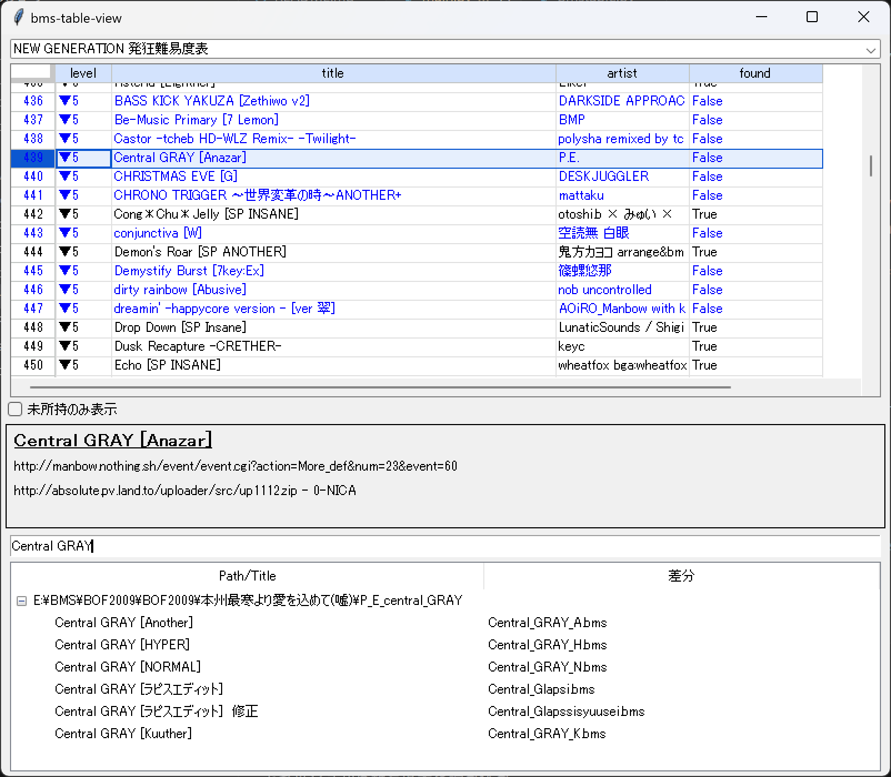

# bms-table-view



未所持の BMS 譜面を導入するための個人用ツール

- 難易度表を読み込んで表示する
- 所持していない曲をリストアップする
- 所持している曲の中からタイトルで検索し、フォルダをエクスプローラで開く

## 動作環境

- Windows 11
- beatoraja 0.8.6

## 開発環境

- Python 3.11.1

## 注意

`songdata.db` のバックアップを推奨します。

## 使い方（.exe ファイルを利用する場合）

### 準備
ダウンロード: [bms-table-view_v1.1.1.zip](https://github.com/voidproc/bms-table-view/releases/download/v1.1.1/bms-table-view_v1.1.1.zip)

### 設定ファイルを配置

`config.json` に beatoraja の `songdata.db` のパスを書く（`config.example.json` をコピーして編集してください）。

例：
```json
{
    "SONGDATA_DB_PATH": "E:/beatoraja/songdata.db",
    ...
}
```

### 起動
`bms-table-view.exe` を実行してください。

### ウィンドウが表示されたら

- 難易度表を選択する（最上部）
- 未所持の曲（青くハイライトされている）を選択する
- 譜面をダウンロードする

差分を導入するときのために、所持している曲のフォルダを検索して開くことができます：
- 曲名が検索用のテキストボックスにコピーされているので、Enterで検索
- 所持している曲が表示される。右クリックでフォルダが開く
- 開いたフォルダにダウンロードした差分をコピーする


## 使い方（Python スクリプトを実行する場合）

### 準備
本リポジトリをクローンまたはソースコードをダウンロード

### モジュールのインストール

```
pip install requests numpy pandas tksheet==6.3.5
```

### 設定ファイルを配置
上記参照

### 起動

```
python ./main.py
```
